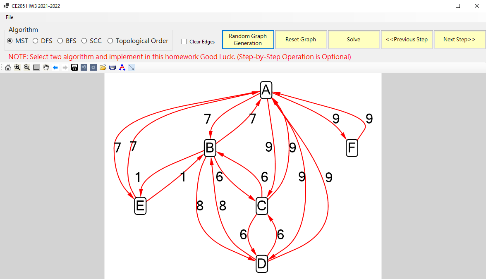
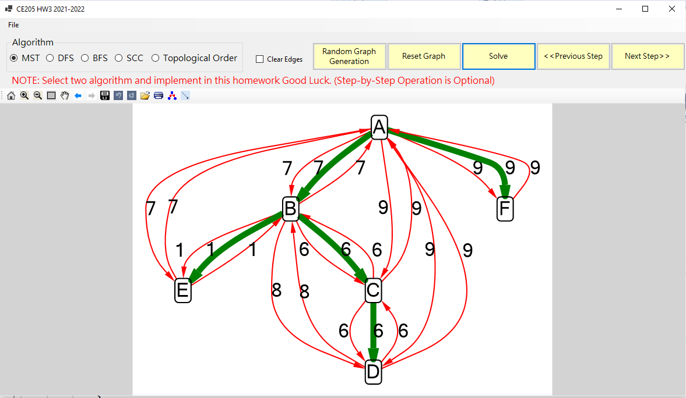
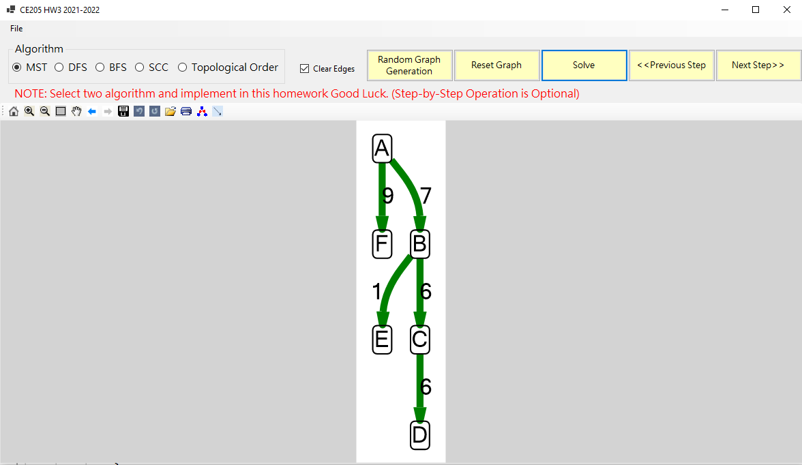

# RTEU CE205 Data Structures Homework 3

In this homework you will implement BFS, DFS, SCC and Topological Sort with Microsoft AutomaticGraphLayout

In this template you will find MST sample, according to this sample you will select two algorithms and implement with your self.

